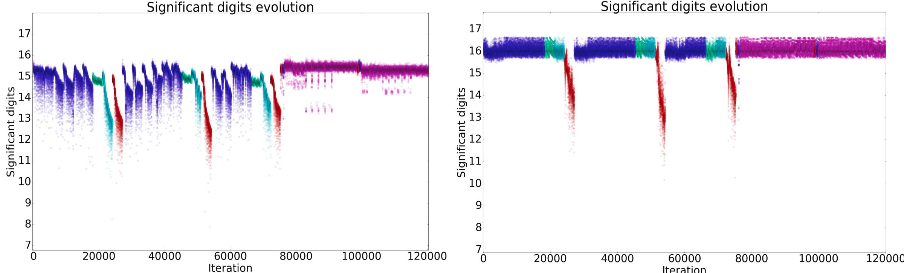
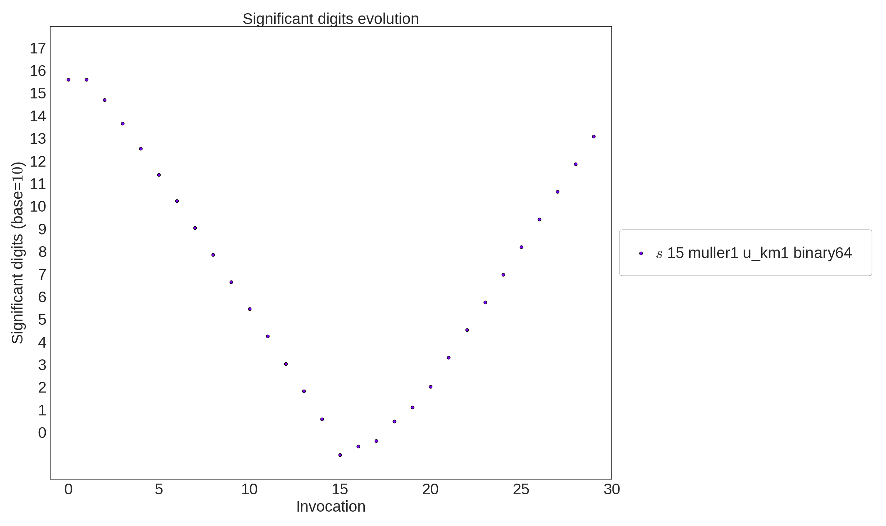

<p align="center">
  
</p>

## Veritracer v0.0.1

[](https://travis-ci.org/verificarlo/verificarlo)

VeriTracer, a visualization tool that brings temporal dimension to a graphical Floating-Point analysis.

### Using Verificarlo through its Docker image

A docker image is available at https://hub.docker.com/r/verificarlo/verificarlo/. 
This image uses the last git master version of Verificarlo and includes support for Fortran and uses llvm-3.5 and gcc-4.7.

Example of usage:

```bash
$ cat > test.c <<HERE
#include <stdio.h>
int main() {
  double a = 0;
  for (int i=0; i < 10000; i++) a += 0.1;
  printf("%0.17f\n", a);
  return 0;
}
HERE

$ docker pull verificarlo/verificarlo
$ docker run -v $PWD:/workdir verificarlo/verificarlo \
   verificarlo test.c -o test
$ docker run -v $PWD:/workdir verificarlo/verificarlo \
   ./test
999.99999999999795364
$ docker run -v $PWD:/workdir verificarlo/verificarlo \
   ./test
999.99999999999761258
```

### Installation

Please ensure that Verificarlo's dependencies are installed on your system:

  * GNU mpfr library http://www.mpfr.org/
  * LLVM, clang and opt from 3.3 up to 4.0.1 (the last version with Fortran support is 3.6), http://clang.llvm.org/
  * gcc, gfortran and dragonegg (for Fortran support), http://dragonegg.llvm.org/
  * python, version >= 2.7
  * autotools (automake, autoconf)

Then run the following command inside verificarlo directory:

```bash
   $ ./autogen.sh
   $ ./configure
   $ make
   $ sudo make install
```

If you do not care about Fortran support, you can avoid installing gfortran and dragonegg, by passing the option `--without-dragonegg` to `configure`:

```bash
   $ ./autogen.sh
   $ ./configure --without-dragonegg
   $ make
   $ sudo make install
```

If needed LLVM path, dragonegg path, and gcc path can be configured with the
following options:

```bash
   $ ./configure --with-llvm=<path to llvm install directory> \
                 --with-dragonegg=<path to dragonegg.so> \
                 CC=<gcc binary compatible with installed dragonegg>
```

Once installation is over, we recommend that you run the test suite to ensure
verificarlo works as expected on your system:

```bash
   $ make installcheck
```

If you disable dragonegg support during configure, fortran_test will fail.

For example on an x86_64 Ubuntu 14.04 release, you should use the following
install procedure:

```bash
   $ sudo apt-get install libmpfr-dev clang-3.3 llvm-3.3-dev dragonegg-4.7 \
       gcc-4.7 gfortran-4.7 autoconf automake build-essential

   $ cd verificarlo/
   $ ./autogen.sh
   $ ./configure \
       --with-dragonegg=/usr/lib/gcc/x86_64-linux-gnu/4.7/plugin/dragonegg.so \
       CC=gcc-4.7
   $ make 
   $ sudo make install
   $ make installcheck
```

### Usage

To automatically trace a program with Veritracer, you must compile it by using
the `verificarlo --tracer` command.
First, make sure that the verificarlo installation directory is in your PATH
and in your PYTHONPATH

Then you can use the `verificarlo --tracer` command to compile your programs. Either modify 
your makefile to use `verificarlo` as the compiler (`CC=verificarlo` and
`FC=verificarlo` ) and linker (`LD=verificarlo`) or use the verificarlo command
directly:

```bash
   $ verificarlo --tracer *.c *.f90 -o ./program
```

If you only wish to instrument a specific function in your program, use the
`--function` option:

```bash
   $ verificarlo --tracer *.c -o ./program --function=specificfunction
```

When invoked with the `--verbose` flag, veritracer provides detailed output of
the instrumentation process. 

Information on variables instrumented are gathered in the `locationInfo.map` file.
By default, this file is created in the directory where compilation is made.
You can change it by modifying the environment variable `VERITRACER_LOCINFO_PATH`.

It is important to include the necessary link flags if you use extra libraries. For example, you should include `-lm` if you are linking against the math library and include `-lstdc++` if you use functions in the standard C++ library.

### MCA Configuration Parameters

After execution, veritracer produces a file named `veritracer.dat` which contain the raw
values collected during the execution. By default, it is a binary file,
but it can be switched to text format by specifying the `--tracer-format=text`
option.

Tools are provided for processing traces. However, for gathering
data with the script, you must respect the following format for your directory
which is explained in the Postprocessing section.

 * `MCA`: (default mode) Montecarlo Arithmetic with inbound and outbound errors
 * `IEEE`: the program uses standard IEEE arithmetic, no errors are introduced
 * `PB`: Precision Bounding inbound errors only
 * `RR`: Random Rounding outbound errors only

### Postprocessing

The environement variable `VERIFICARLO_PRECISION` controls the virtual precision
used for the floating point operations. It accepts an integer value that
represents the virtual precision at which MCA operations are performed. Its
default value is 53. For a more precise definition of the virtual precision, you
can refer to https://hal.archives-ouvertes.fr/hal-01192668.

Verificarlo supports two MCA backends. The environement variable
`VERIFICARLO_BACKEND` is used to select the backend. It can be set to `QUAD` or
`MPFR`

The  `postprocessing/veritracer/` directory contains postprocessing tools for visualizing information produced by veritracer. Veritracer postprocess tools use a git-style command.
The two principal commands are `veritracer analyze` for gathering information and `veritracer plot` for visualizing information.

#### Analyze

```bash
   $ veritracer analyze
```
For gathering data with the script, you must respect the following format for your directory:
for `n` runs in the directory `exp`, you should have:

```bash
   $ ls -R exp
   $ exp/1: veritracer.dat exp/2: veritracer.dat ... exp/n: veritracer.dat
   $
   $ cd exp/
   $ veritracer analyze -f veritracer.dat -o output.csv
```
You can also use the `veritracer launch` module for launching several parallel executions
with the appropriate directory structure

```bash
   $ veritracer launch --jobs=<N> --binary=program  
```

#### Plot

`veritracer plot` allows visualizing data from `output.csv` file.


```bash
   $ veritracer plot <file.csv> 
```

For visualizing specific variables, you can use the `--variables` option.
Use the hash value of the variable which is available in the `locationInfo.map`.

```bash
   $ veritracer plot <file.csv> --variables=<hash1> <hash2> ... <hashN>
```

### Examples

The `tests/veritracer` directory contains an example of Veritracer usage.



`veritracer plot` usage on ABINIT [1] code.  



`veritracer plot` usage on Muller's sequence [2]


### How to cite VeriTracer


If you use VeriTracer in your research, please cite the following paper:

    @inproceedings{Chatelain2018veritracer,
			 author = {Yohan Chatelain and
             Pablo de Oliveira Castro and
             Eric Petit and
             David Defour and
             Jordan Bieder and
             Marc Torrent},
			 title = {{VeriTracer: Context-enriched tracer for floating-point arithmetic analysis}},
			 booktitle = {25th {IEEE} Symposium on Computer Arithmetic, {ARITH} 		2018, Amherst, MA, USA. June 25th-27th, 2018},
			 pages = {(to appear)},
			 year = {2018}}

Thanks !

### Discussion Group

For questions, feedbacks or discussions about Verificarlo you can join our group at,

https://groups.google.com/forum/#!forum/verificarlo

### License

Copyright (c) 2018
   Universite de Versailles St-Quentin-en-Yvelines
   CMLA, Ecole Normale Superieure de Cachan

Verificarlo is free software: you can redistribute it and/or modify
it under the terms of the GNU General Public License as published by
the Free Software Foundation, either version 3 of the License, or
(at your option) any later version.

Verificarlo is distributed in the hope that it will be useful,
but WITHOUT ANY WARRANTY; without even the implied warranty of
MERCHANTABILITY or FITNESS FOR A PARTICULAR PURPOSE.  See the
GNU General Public License for more details.

You should have received a copy of the GNU General Public License
along with Verificarlo.  If not, see <http://www.gnu.org/licenses/>.

### References

[1] X. Gonze, F. Jollet, et al., “Recent developments in the
ABINIT software package,” Computer Physics Com-
munications, vol. 205, pp. 106–131, 2016.

[2] J.-C. Bajard, D. Michelucci, J.-M. Moreau, and J.-
M. Muller, “Introduction to the Special Issue ”Real
Numbers and Computers”,” in The Journal of Universal
Computer Science, pp. 436–438, Springer, 1996.
