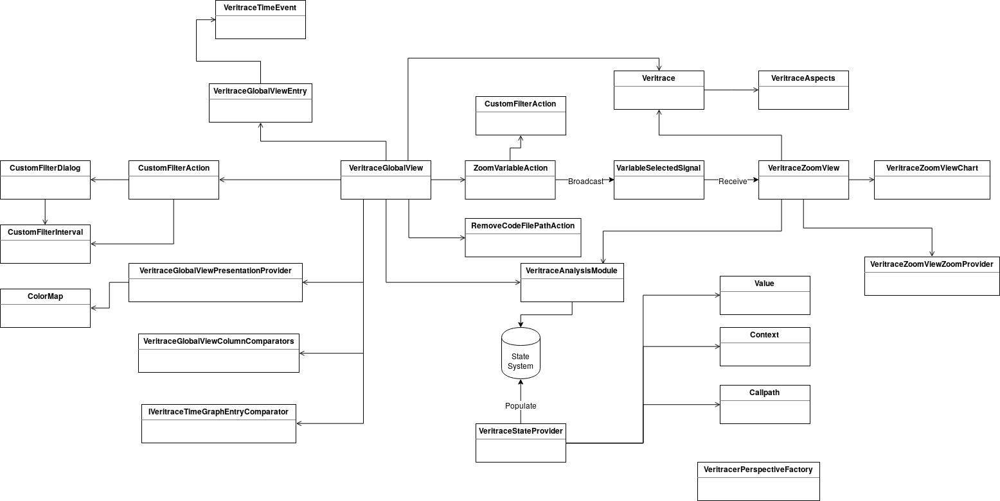

# Contributor's guide

## Code composition

The plugin is composed of several parts :

* The views : the Zoom View and the Global View
* The StateProvider
* The trace analysis module
* The actions and signals



### The views

**The Global View** is defined in the `VeritraceGlobalView*.java` files.\
The `VeritraceGlobalView.java` contains the core of the Global View, it inherits *AbstractTimeGraphView* from [Trace Compass](https://www.eclipse.org/tracecompass/).
`VeritraceGlobalViewPresentationProvider.java` define the colors of the events.\
`VeritraceGlobalViewEntry.java` define  an entry in the Global View. An entry is a vertical entry in the tree on the left of the Global View.\
`VeritraceTimeEvent.java` define a time event which belongs to a GlobalViewEntry.

**The Zoom View** is defined in the `VeritraceZoomView*.java` files.\
The `VeritraceZoomView.java` file contains the core of the Zoom View. It initiate the view and receive *TmfSignal* creating the Charts.\
The `VeritraceZoomViewChart.java` file contains the charts related code.\
The `VeritraceZoomViewZoomProvider.java` file contains the listeners for the zoom functionnality on a chart.

### The State Provider

**The State Provider** is defined in `VeritraceStateProvider.java`.
It is called on the first time a trace is opened in Trace Compass, it receives an event in `eventHandle` and calls the correct handler for the event type. The handlers for event types is defined in `createHandlers`, you would have to add a handler here if you wanted to handle a new type of event.

The *State System* is a functionality of Trace Compass that is used to store information on a trace in a way allowing to retrieve it easily and cheaply.
You can obtain more information in the [documentation](http://archive.eclipse.org/tracecompass/doc/stable/org.eclipse.tracecompass.doc.dev/Generic-State-System.html#Generic_State_System) of Trace compass about the State System.\
Reading it is advisable before doing any change on the *State System* or the State Provider.

### The trace analysis module

**The Analysis module** is defined in `VeritraceAnalysisModule.java`. It defines the requirements on the trace and the function used to extract data from the State System.

### The Actions and Signals

#### Actions

**The OpenCodeFileAction** is the action opening the source code at the correct line.\
It is defined in `OpenCodeFileAction.java`

**The RemoveCodeFilePathAction** is the action deleting the previously saved path to the source code.\
It is defined in `RemoveCodeFilePathAction.java`

**The ZoomVariableAction** is the action sending the signal *VariableSelectedSignal* adding or removing a variable from the Zoom View.\
It is defined in `ZoomVariableAction.java`

#### Signals

**The VariableSelectedSignal**  is used to indicate when a variable has been selected by the user to be displayed on the Zoom View.

```java
public VariableSelectedSignal(Object source, ITmfTrace trace, String name, int variableQuark)
```

It is defined in `VariableSelectedSignal.java`

**The TmfTraceSelectedSignal** is a Trace Compass signal used when a trace has been selected by the user.

**The TmfSelectionRangeUpdatedSignal** is a Trace Compass signal used when the range selected is updated. The Zoom View is responding to this signal by displaying the variable's data on the given range.

## Modifying the project

### Adding a new type of event

To add a new type of event to read from a trace, you have to add a handler in `VeritraceStateProvider.java` in *createHandlers*. This handler need to extract the content of the event and store it in the State System.
If you change anything in the State Provider and need it to rebuild the *State System*, updating the version in the StateProvider java file will make it rebuild the *State System*.

### Change the way the information are loaded from the State System

The information are loaded from the State System in the Analysis Module.
Each view has a way to deal with information and can too access the State System directly if needed (in the Zoom View, it is the charts which individually load data).

To obtain the State System :

```java
ITmfStateSystem stateSystem = TmfStateSystemAnalysisModule.getStateSystem(fTrace, VeritraceAnalysisModule.ID);
```

To obtain the Analysis Module :

```java
VeritraceAnalysisModule analysisModule = TmfTraceUtils.getAnalysisModuleOfClass(fTrace, VeritraceAnalysisModule.class, VeritraceAnalysisModule.ID);
```

### To create a new view

In `plugin.xml`, add a view to the extension `org.eclipse.ui.views` which inherits from `TmfView` or another class inherithing from it like `AbstractTimeGraphView`.