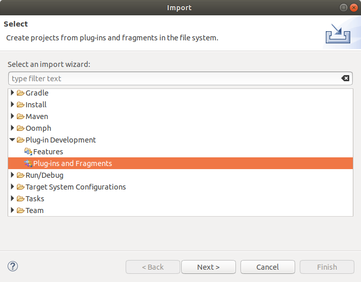
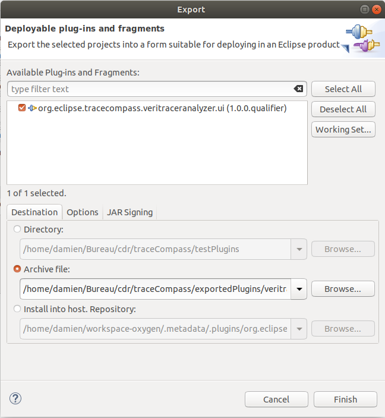

# Compiling

## From Eclipse
\
Import the project as a Plug-in and export it with Eclipse export wizard.\
\
You can select  the **Install into host** option to directly install the project into the current Eclipse installation.

## From CLI

The plugin use Tycho for Maven for the compilation, use in the `org.eclipse.tracecompass.sample.ui` directory:

```bash
    mvn package
```

And retrieve the plugin **jar** file from the `target` subdirectory and move/copy it to the `dropins` subdirectory of your Eclipse install.

## Create a update site

Creating a update site is done from Eclipse with the plugin development tools. You need to import all three projects in Eclipse `org.eclipse.tracecompass.sample.ui`, `org.eclipse.tracecompass.veritracervisualizer` and `veritracer_updatesite`.
Then in `veritracer_updatesite`, open `site.xml` and *Build all* this will build the plugin and features.\
Now you have your update site in a local directory that you can install on the Trace Compass standalone app using *Install New Software* in the *Help*.