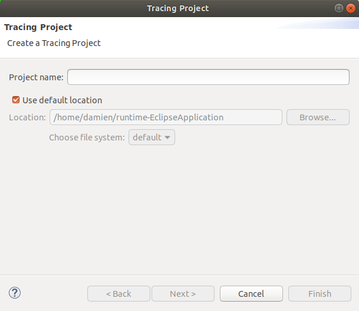
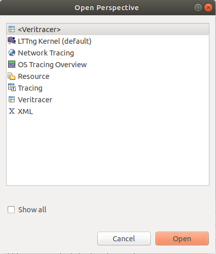
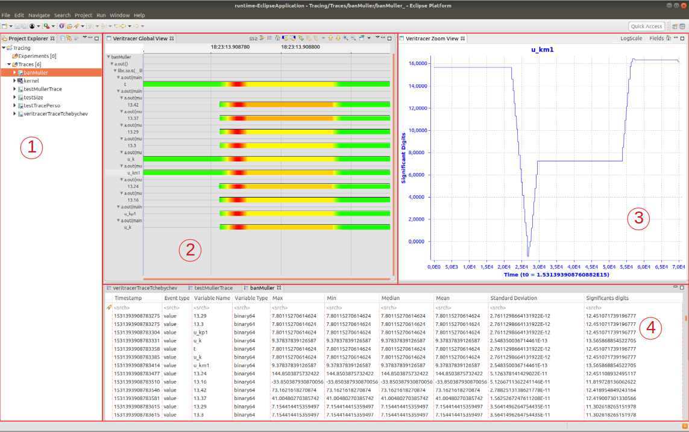

# Veritracer Visualizer

Veritracer Visualizer is a visualization tool for Veritracer traces, it takes the form of a plugin for the [Trace Compass](http://tracecompass.org/) visualization tool used by the LTTng tracing framework.\
The tool comes with a python program using the Babeltrace's python bindings to easily obtain binary traces from Veritracer native traces in the [Common Trace Format](http://diamon.org/ctf/).

## Installation

Please ensure that you have the following dependencies installed on your system :

* Trace Compass version 3.3.0 Eclipse plugin http://tracecompass.org/ on Eclipse Oxygen 3a
* Babeltrace python binding https://www.efficios.com/babeltrace/

With the **Veritracer Visualizer jar** file, you just have to put it in the `eclipse/dropins` directory and launch eclipse (if your eclipse doesn't see the plugin use the **-clean** command to force it to reload its workspace settings).\
Or with the standalone Trace Compass application, use the update site to install the plugin.

To compile it from sources and create the update site, see [`INSTALL.md`](./INSTALL.md)

## Usage

### Trace generation from Veritracer native traces

Run the following command in the Veritracer's trace directory after having executed Veritracer:

```bash
    python3 traceVeritracer.py <output directory>
```

### Trace visualization

Inside Eclipse, create a new Tracing project\
\
and change the current perspective to Veritracer\


On the Project Explorer, right click on Traces and select **Open Trace...**, choose the directory containing your CTF trace to examine.



Here, we can see :

1. Project Explorer
1. Veritracer Global View
1. Veritracer Zoom View
1. Event view

#### Project Explorer

The **Project Explorer** allow you to follow multiple project you are working on, open new projects and add trace to analyze to an existing tracing project.

#### Veritracer Global View

The **Veritracer Global View** show the evolution of the Floating-Point precision over time by variable, you can select a timerange with left-click and drag to show it on the Zoom View or right-click and drag to zoom on the Global View.\
You can right-click on a variable name on the left side to add it to the Zoom View an take a closer look at it, you can also open it's location in the source code and remove the previously registered path to the source code you entered.\
The **s\<** button allows to set which lower limit you want, it will hide every variables and events not corresponding to the filter and in doing so highlight the variables showing floating-point precision problems.

#### Veritracer Zoom View

The **Veritracer Zoom View** show a variable's values evolution over time with more details. You can use the **fields** button to select which value you wish to show on the Zoom View, multiple values can be shown at the same time to be able to cross data.\
The home button reset the timescale to show the variable on all its lifetime.\
The **logScale** button activate the log scale on the graphs and will make the values of the chart absolute.

#### Veritracer Event View

The **Event View** show events contained in the Trace, you can filter on name or type.
You can also right-click on the legend line to be able to select which information you want to be shown.

Another possibility to filter exist with the Trace Compass' **Filter** View where you can create and save custom filters to apply to your traces allowing to create powerful custom filters for the Event View.

### Trace Format

The CTF format is explained in the [`TraceFormat.md`](./TraceFormat.md) file.

### To contribute

To contribute, see the contributor's guide in [`ContributorsGuide.md`](./ContributorsGuide.md) which explain the basic about the code.
